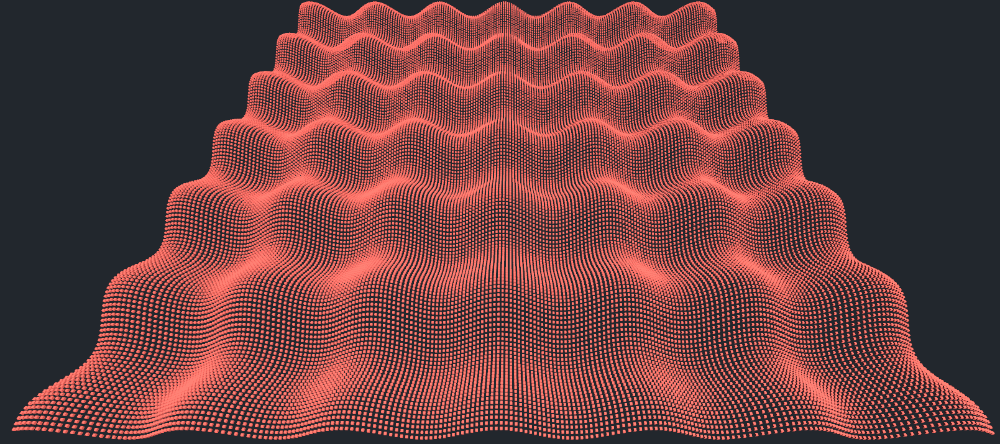

# Unity DOTS Examples

According to the [documentation](https://unity.com/dots), Data Oriented Technology Stack (DOTS) includes technologies and packages that deliver a data-oriented design approach to building games in Unity. Implementing technologies in DOTS can result with huge (and also surprising) performance improvements. Thanks to different packages such as [Jobs](https://docs.unity3d.com/Manual/job-system.html), [Burst](https://docs.unity3d.com/Packages/com.unity.burst@1.8/manual/index.html), [Mathematics](https://docs.unity3d.com/Packages/com.unity.mathematics@1.3/manual/index.html), [Collections](https://docs.unity3d.com/Packages/com.unity.collections@2.5/manual/index.html) and [Entities](https://docs.unity3d.com/Packages/com.unity.entities@1.3/manual/index.html) in it, DOTS increases performance by three major improvements:
* **Multithreading:** Job system provides an easy and safe way for multithreading with the help of Collections and Mathematics packages.
* **Burst Compiling:** Burst package compilies all the supported code Ahead-of-Time (AOT) into a native library.
 * **Unmanaged Entity System:** ECS package provides an unmanaged and data-oriented way for game programming to be able to reduce cache misses and garbage amount.

This repository has multiple example cases for DOTS packages and it tests their effects on performance. Additionally, it has extra test cases for physics and compute shaders.

## Test Cases

Each test case aims to create a 2D sinusoidal wave by simulating 100x100 cubes. You can use another shape (for example sphere) instead of cube however, it results with GPU bounded results. Cube is an ultra-low poly shape, so to be able to test CPU properly, it is the best option. Following screenshot shows the simulated 2D sinusoidal wave.

There are 5 different test cases for this simulation:
* **(1) Default Case:** The very basic case with game objects, no multithreading, no burst compilation, no entities.
* **(2) Jobs Case:** Multithreading with game objects by using jobs system, uses burst compilation, no entities.
* **(3) ECS Case:** Multithreading with entities by using ECS package and jobs system, uses burst compilation.
* **(4) Compute Shader Case:** Multithreading on GPU with game objects by using compute shader, no burst compilation.
* **(5) Compute Shader with Entities Case:** Multithreading on GPU with entities by using ECS package and compute shader, uses burst compilation.

Additionally, there are 2 extra test cases physics:
* **(1) Default Physics Case:** The very basic case with game objects and rigidbodies, no multithreading, no burst compilation, no entities.
* **(2) ECS Physics Case:** Multithreading with entities by using ECS Physics package and jobs system, uses burst compilation.

## Results

Following tests are runed on a laptop with Intel i7-12650H processor, 32GB of RAM and Nvidia RTX 3060 GPU.

Test results for 2D sinusoidal wave simulation cases:
| Case   | FPS  | Relative FPS |
| ------ | :-:  | :----------: |
| Case 1 |  28  | 1x           |
| Case 2 |  31  | 1.11x        |
| Case 3 |  322 | 11.5x        |
| Case 4 |  29  | 1.03x        |
| Case 5 |  176 | 6.29x        |

Test results for physics cases:
| Case   | FPS Interval | Relative FPS Interval |
| ------ | :----------: | :-------------------: |
| Case 1 | 16 - 41      | 1x - 1x               |
| Case 2 | 27 - 330     | 1.67x - 8.05x         |

**Note:** FPS values are given as intervals for physics cases because FPS varies with respect to the number of collisions during physics simulation.
## Comments

**Job System and Burst Compilation:** They are easy to implement and have acceptable effects on performance. I recommend you to use them whenever it is possible.

**Entity Component System (ECS):** It has surprising, shocking and “OMG level” effects on performance, however it is quite hard to implement it. It is not compatible with almost everything you got used to be (game objects, components, object-oriented architectures, etc.), so it is a new brave world. As Winston Churchill said, it has nothing to offer but blood, toil, tears, sweat and super performance. So, use it only when you really need it. To make implementation easier, you can use a partial implementation (implementing ECS for the parts of your game only which really need it) if it is possible.

**Compute Shaders:** It is moderate to implement them and their effects on performance are variable. On the other hand, they run on GPU, so they use almost no compute power of CPU. Since it takes time to send data to GPU and bring it back to CPU, they aren’t as fast as ECS. However, they are compatible with default Unity system (game objects, components, etc.) and they don’t use CPU, so they are good alternatives to ECS. For example, [VFX Graph]( https://docs.unity3d.com/Packages/com.unity.visualeffectgraph@17.0/manual/index.html) uses compute shaders to simulate particles.

**Data Oriented Programming vs. Object Oriented Programming:** We all love OOP, maybe it is the best thing we programmers have. On the other hand, CPUs don’t love it, obviously. When we need more performance, we have to do what CPUs love. So, in my personal opinion, we should consider to use DOP instead of OOP, seriously.

**Conclusion:** Every game is unique and there is no perfect fit solution. If you have doubts about the performance of a game and are planning to use ECS, do it at the very beginning of the project. Implementing ECS to an existing project wastes your previous effort. Implement jobs system and Burst compiler whenever you need it, they should be in your daily toolbox. Consider CPU and GPU bounds for compute shaders. If your game is CPU bounded, then carrying processes to GPU via compute shaders can be a good option to consider. However, don’t use compute shaders for a GPU bounded game.